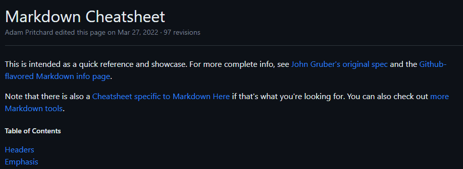

# Projeto com README
Um projeto de teste com um arquivo README 🚀

[]

## Tecnologias utilizadas
- HTML
- CSS
- JS

## Como utilizar
Com git bash

1. Clone o projeto.

    ```
    git clone <url>
    ```

2. Acesse a pasta do projeto

    ```
    cd repositorio-com-readme
    ```